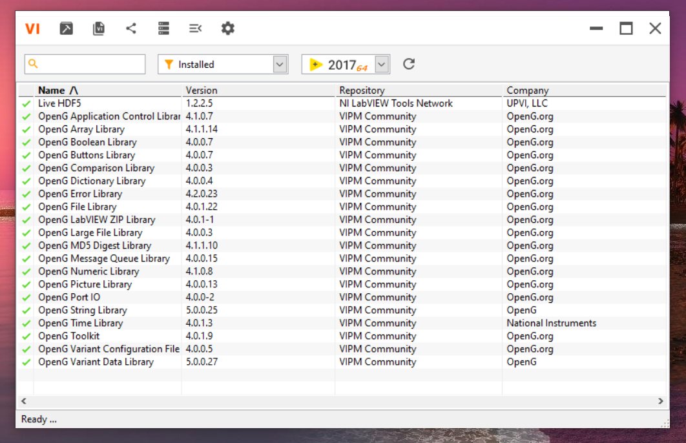
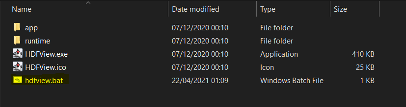
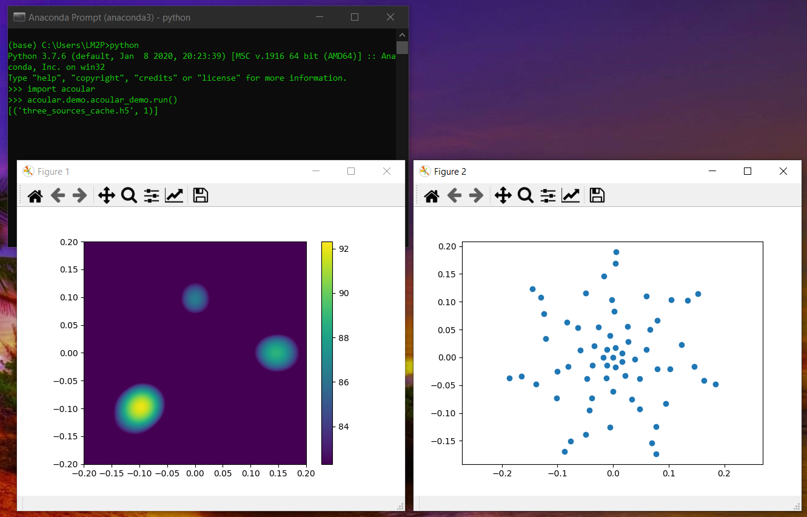
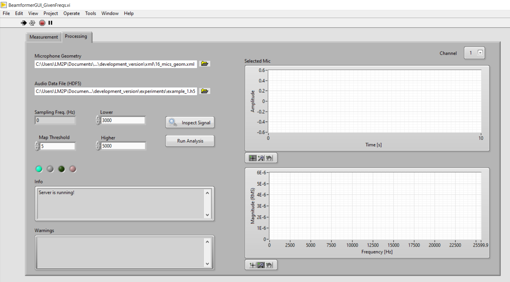
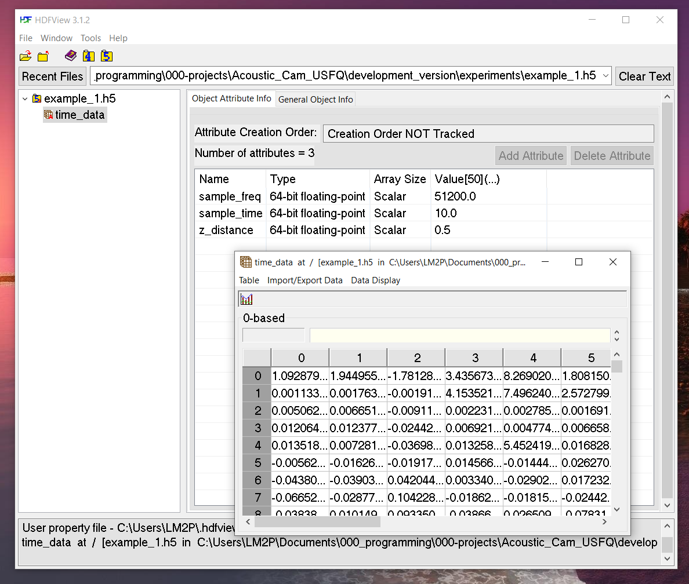
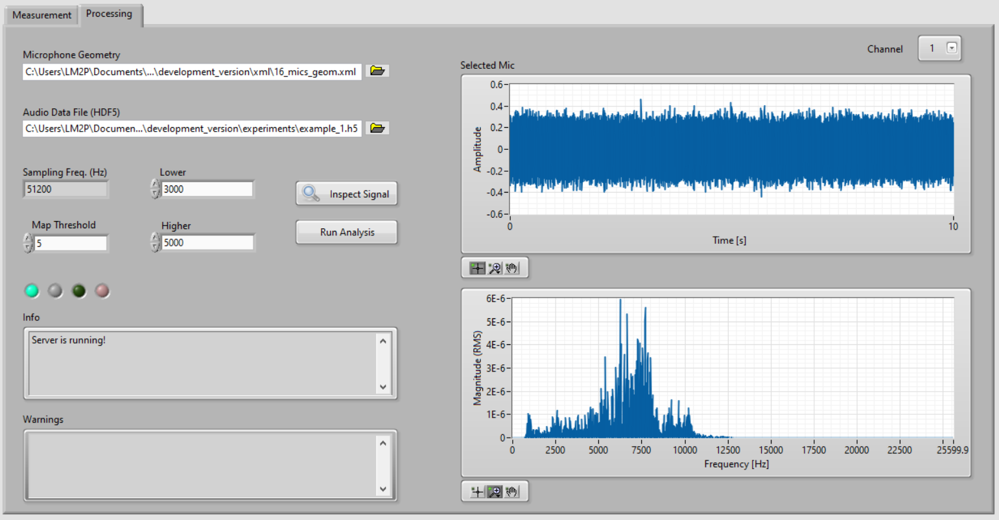
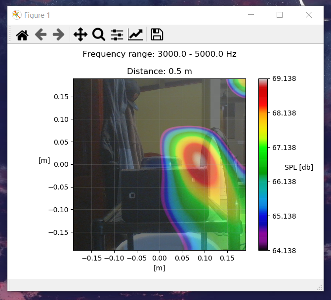
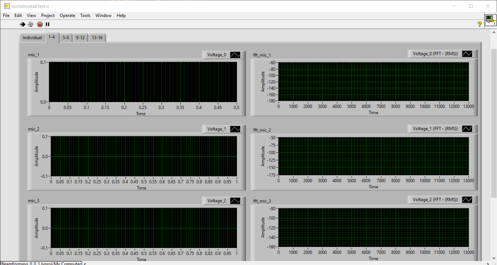
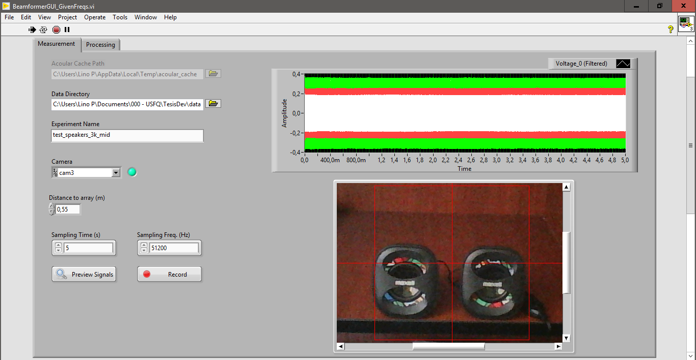
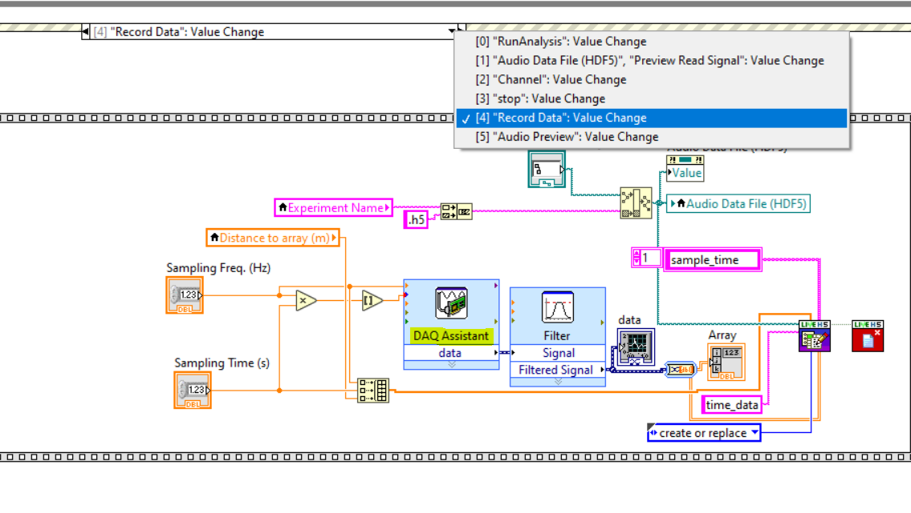

# Dependencies

**Important**: Install all of these packages/tools **in the same order** as they appear.

### Python
- [Anaconda with Python 3 support](https://www.anaconda.com/products/individual)
- [The acoular library](http://www.acoular.org/)
  - Note: make sure you go through their `Installation` and `Getting Started` sections to verify your installation is correct.

### LabView 
- [LabView 2017 SP1](https://drive.google.com/file/d/1f0ta16s_hXl4AfWJfx2E_lHg1bpLfRXV/view?usp=sharing) 
  - Note: uncheck the VI Package Manager 2017 option. You will be installing the latest version directly from their website, which works better.  
- [VI Package Manager (VIPM)](https://www.vipm.io/download/)
  - Note: after installing, hit the button that looks like a "refresh" icon to update the package repository so VIPM will work correctly.   

It is recommended to install these packages with VIPM, in this exact order:
- [OpenG Libraries](https://www.vipm.io/package/openg.org_lib_openg_toolkit/)   
- [LiveHDF by UPVI](https://www.vipm.io/package/lvhdf5/) ([documentation](http://www.upvi.net/main/index.php/products/lvhdf5))

  At this point, your installed package listing should contain at least all these:

  

These ones are installed from outside VIPM:
- [NI DAQmx](https://www.ni.com/en-us/support/downloads/drivers/download.ni-daqmx.html#348669) for microphone data acquisition
- [VAS](https://www.ni.com/en-us/support/downloads/drivers/download.vision-acquisition-software.html#367318) for LabView to webcam interfacing

### Recommended
- [HDFView](https://www.hdfgroup.org/downloads/hdfview/) to inspect HDF5 files of your audio recordings and their metadata.
  - Note: If the program fails to launch, [try the solution mentioned here](https://portal.hdfgroup.org/display/support/HDFView+3.1.2#HDFView3.1.2-knownprobs). 
   
    To make the HDFViewApp-3.1.2 work on Windows 10 (64 bits), they ask you to download and paste the `hdfview.bat` file here:

      

    Then the app can be opened by double clicking on that `hdfview.bat` file.

# Testing the VI

## Verify Acoular installation
After going through the [installation described here](http://www.acoular.org/install/index.html), you should be able to: 
- open the Anaconda prompt
- type `python` to open the python interpreter
- type the statements shown here and get the following results:

## Run the provided example

To test your environment, an example measurement is provided. This includes an image and a white-noise recording in an hdf5 file.

- Open the project **`development_version/Beamforming_0_0_1.lvproj`**. In there open the VI called **`BeamformerGUI_GivenFreqs.vi`** and execute it.

- Switch from the `Measurement` tab to the `Processing` tab.
  
  - The Python server should be started in the background, give it some time. When the VI is ready to perform an analysis, it looks like this:
  
     

  - By default, the VI already searches for the microphone geometry file `16_mics_geom.xml` in the `development_version/xml` folder. If you ever need to include another microphone geometry file, that is the place to add it.

  - For the `Audio Data File (HDF5)` option, make sure it points to: `development_version/experiments/example_1.h5` (should be done by default too, but please double check).
  
    - Inspecting it with HDFView:
    
      
    
    - Inspecting it with the `Inspect Signal` function:
  
      

    - Click on `Run Analysis` and you should get this message:
  
      

      And the following plot:

      

## Performing New Measurements

**Tip:** read `Final Report.pdf` for information about best-performing parameters.

- In the `Measurements` tab, you can use the `Preview Signals` button to check the status of the microphones:

  

- Select the camera device.
- Focus the camera to the desired object/scenario to analyze.
- Select the data directory.
- Input a name for the experiment (will be used both for the audio recording and the image).  
- Input the distance in [m] from the array to the sound source.
- Input a sampling time and a sampling frequency. 
  - Note: Take into account that the hardware has its sampling rate limitations. Also, theoretically the sampling frequency has to be at least twice the maximum frequency in the signal you wish to analyze (see [Nyquist Theorem](http://microscopy.berkeley.edu/courses/dib/sections/02Images/sampling.html) / [Recommended Video](https://www.youtube.com/watch?v=yWqrx08UeUs)).  
- Click record and wait.
- After recording, the GUI should look like this:
  
   

- Switch to the `Processing` tab. It will already be pointing to the newly created data file. There you can `Inspect` the signal or `Run   Analysis` immediately, like in the previous section.

- The `Lower` and `Higher` parameters determine the beggining and start of the frequency range to be taken into account for the actual acoustic map.

## Notes
- The VI measurement feature cannot be performed without the Data Acquisition board already connected and configured.  

- There might be setup and or additional driver installation required when connecting the Data Acquisition board. 
  
  Locate this section of the `BeamformerGUI_GivenFreqs.vi` block diagram and open the `DAQ Assistant` to configure your hardware:

   

- The calibration file location is currently `/development_version/xml/ECM8000_07_09_19_01.xml` and this is hard-coded in the `development_version/py/beamforming.py` file. Take this into account if you need to provide a different file.

- Take note of the `Acoular Cache Path` in the `Measurement` tab. Acoular saves previous results there to optimize performance but you might need to manually clear the contents of that folder if you want to analyze new measurements with a same filename you used previously. 
