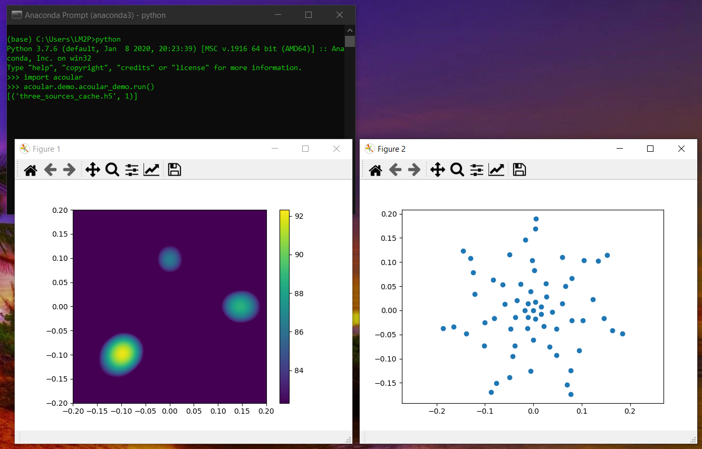

# Dependencies

### Python
- [Anaconda3 (2019.07 build)](https://repo.anaconda.com/archive/Anaconda3-2019.07-Windows-x86_64.exe)
- [The acoular library](http://www.acoular.org/)
  - Note: make sure you go through their `Installation` and `Getting Started` sections to verify your installation is correct.

### LabView 
**Install this first!**
- LabView 2017 SP1 (uncheck the VI Package Manager 20117 option; the latest version directly from their website works better)  
- [VI Package Manager 2017 (VIPM)](https://www.vipm.io/download/)

It is recommended to install these packages through VIPM. Look for the "Download Package" option and continue installation with VIPM:
- [LiveHDF by UPVI](https://www.vipm.io/package/lvhdf5/) ([documentation](http://www.upvi.net/main/index.php/products/lvhdf5))
- [OpenG Libraries](https://www.ni.com/gate/gb/GB_EVALTLKTOPENG/US)

These ones are installed from outside VIPM:
- [NI DAQmx](https://www.ni.com/en-us/support/downloads/drivers/download.ni-daqmx.html#348669) for microphone data acquisition
- [VAS](https://www.ni.com/en-us/support/downloads/drivers/download.vision-acquisition-software.html#367318) for LabView to webcam interfacing

### Recommended
- [HDFView](https://www.hdfgroup.org/downloads/hdfview/) to explore HDF5 files of your audio recordings.

# Running an example

## Verify Acoular installation
After going through the [installation described here](http://www.acoular.org/install/index.html), you should be able to open the Anaconda prompt, input these commands and get the following results:

## Testing the acoustic cam VI

// TO-DO add instructions for VI

- Image File: `development_version/experiments/example_1.bmp`
- Audio File: `development_version/experiments/example_1.h5`
